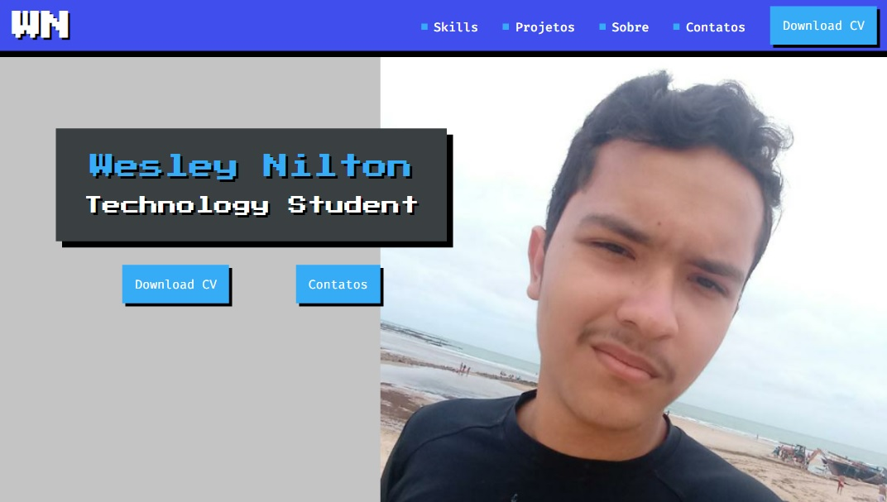

<h1 align="center">Portfólio Feliz</h1>

Repositório destinado ao portfólio criado durante o curso de HTML e CSS feliz.

## 🛑| Avisos
- Este Portfólio foi um projeto realizado durante um curso e não é o que utilizo atualmente, estando desatualizado/incompleto na questão das informações, além de existir informações que apenas complementam o projeto sem representar a minha real trajetória.
- O projeto não é responsivo, por este perfil se tratar de uma evolução pessoal minha, tomei por decisão não melhorar o projeto além do que foi abordado durante o curso.

## 🔎| Visualize
Visualize o resultado atual do projeto:

- [GitHub Pages](https://wesley-nilton.github.io/html-css-feliz/)

## 🛸| Tecnologias
Na construção do projeto foram utilizadas as seguintes tecnologias:

- [HTML](https://developer.mozilla.org/pt-BR/docs/Web/HTML)
- [CSS](https://developer.mozilla.org/pt-BR/docs/Web/CSS)
- [JavaScript](https://developer.mozilla.org/pt-BR/docs/Web/JavaScript)

## 👥| Autor(es)
Autores e contribuidores do projeto:

- [Wesley Nilton](https://github.com/Wesley-Nilton)